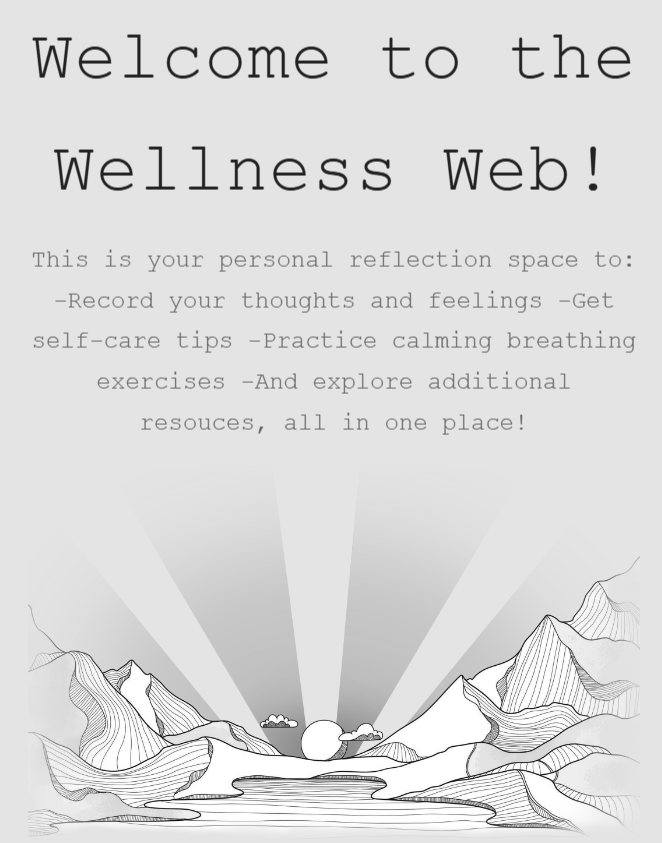
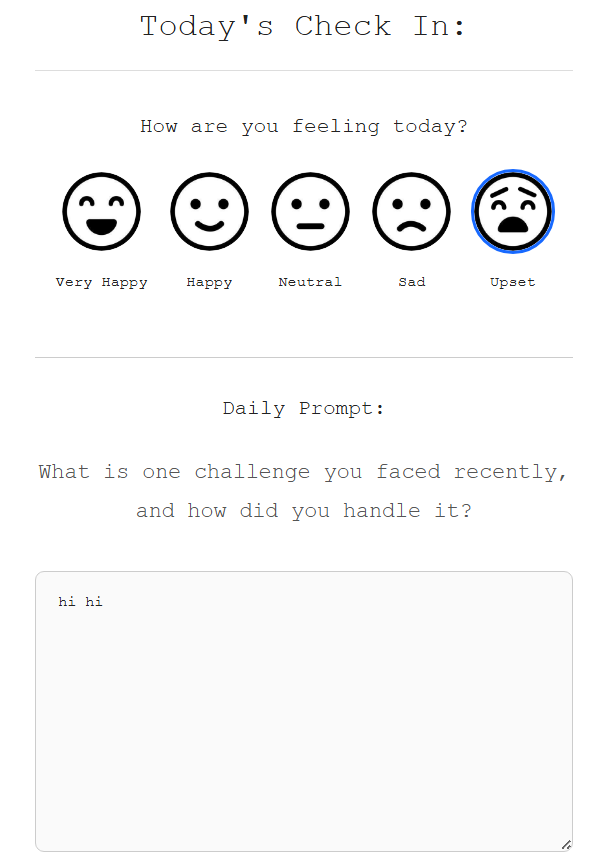
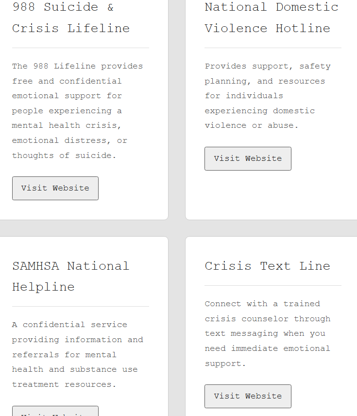
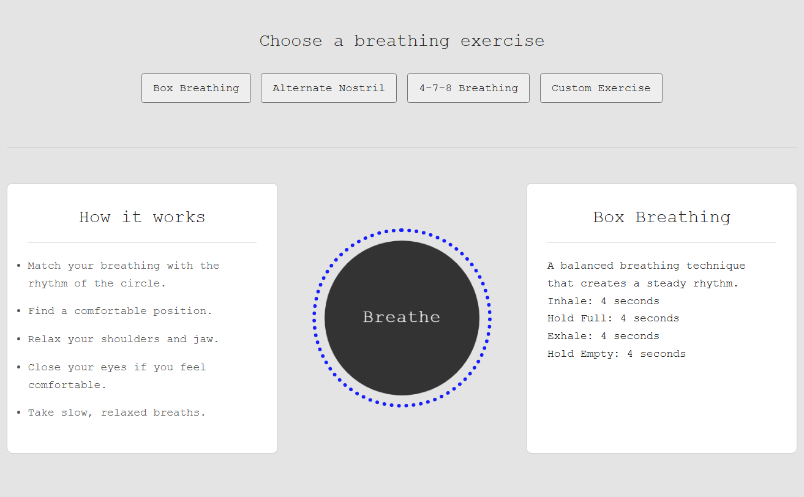
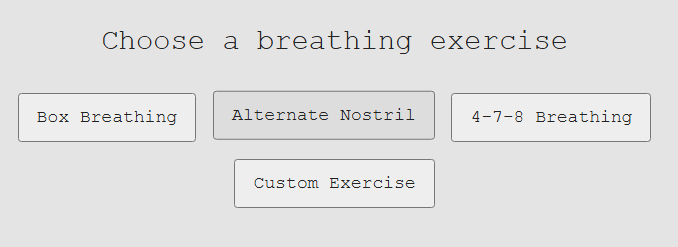
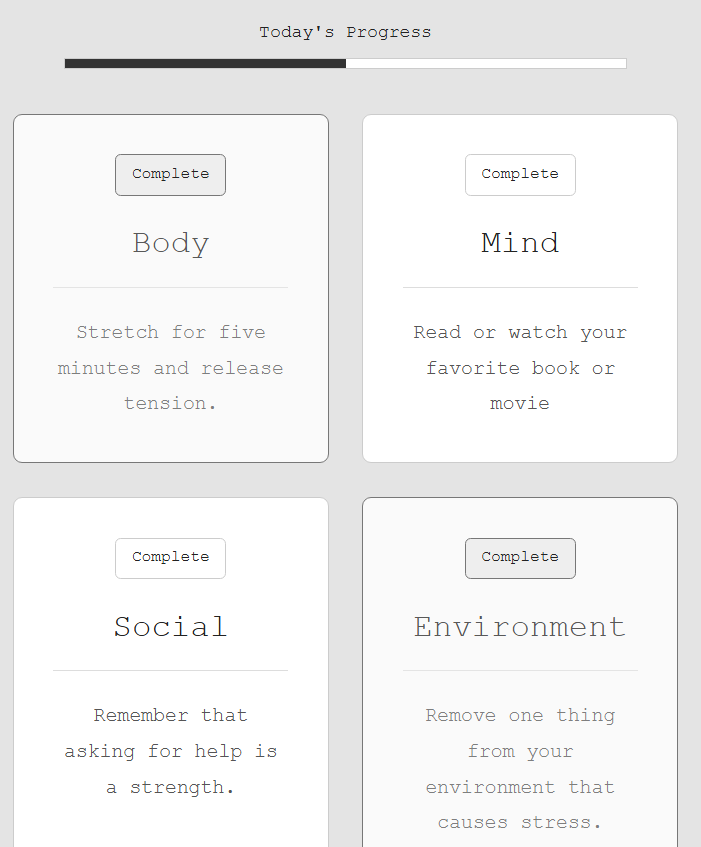
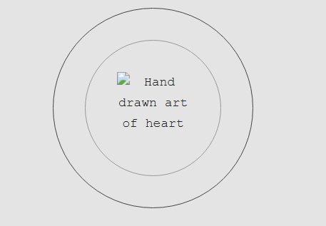
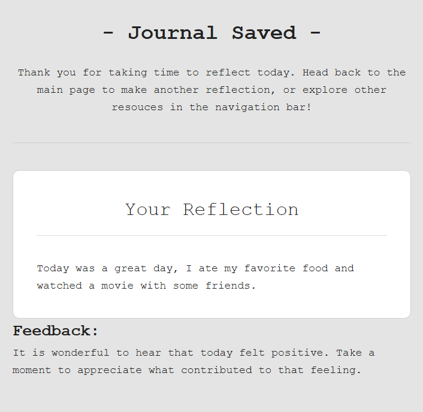
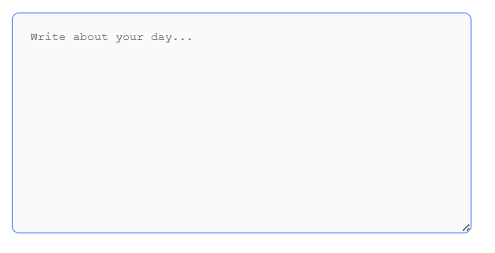
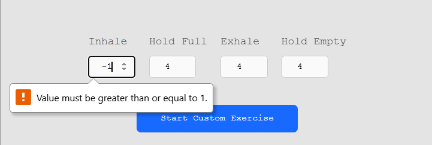

# QA Notes & Testing Report

## Purpose

The purpose of this testing document is to verify that the website is functional, responsive, and accessible across a variety of devices, screen sizes, and user interactions. Testing was performed to ensure that core features behave as expected, layouts adapt correctly to different viewport sizes, and accessibility considerations are implemented consistently.

To support responsiveness, the website uses responsive breakpoints along with Flexbox and CSS Grid layouts to adapt content for desktop, tablet, and mobile devices. Accessibility practices such as semantic HTML, descriptive alt text, and sufficient visual feedback for interactive elements were also reviewed during testing.

Each of the provided test cases and actual results are simply ONE demonstrated example of principles used throughout the website. 

---

## Test Cases

| Test ID | Test Description                        | Expected Result                                                                                        | Actual Result Screenshot       |
| ------- | --------------------------------------- | ------------------------------------------------------------------------------------------------------ | ------------------------------ |
| TC-01   | Welcome page hero image scaling         | Hero image scales proportionally without distortion at smaller breakpoints.      |   |
| TC-02   | Mobile breakpoint journal layout                | Textarea and content stack appropriately on smaller screens without overlap or horizontal scrolling. |        |
| TC-03   | Tablet breakpoint resources layout                | Content reorganizes correctly at tablet widths while maintaining readability and spacing.              |        |
| TC-04   | Desktop breakpoint layout               | Full desktop layout displays correctly with proper spacing and alignment.                              |       |
| TC-05   | Navigation button hover state           | Buttons provide clear visual feedback when hovered, such as color, shadow, or animation changes.       |         |
| TC-06   | Self-care tips button click behavior        | Clicking buttons highlights the completed tip and drives progress bar state.                        |         |
| TC-07   | Missing image accessibility check       | If an image fails to load, descriptive alt text is available and meaningful to users.                  |             |
| TC-08   | Session-dependent journal saving and feedback.                     | User's journal entry and mood state is accurately saved and echoed back along with custom feeback.   |  |
| TC-09   | Textarea placeholder text | Journal textarea has placeholder text to explain purpose of field and/or invite user to reflect on their day.     |    |
| TC-10   | Custom exercise form validation  | Fields display appropriate feedback when an invalid breathing interval is entered.                   |      |

---

## Summary

Testing confirmed that the website's primary functionality, responsive design, and accessibility features operate as intended. Responsive layouts were verified across multiple breakpoints, interactive elements provided appropriate user feedback, and accessibility features such as alt text and button response were confirmed functional.
